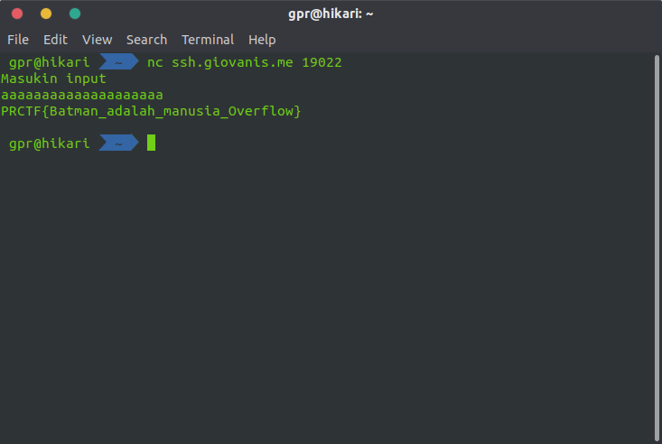

# Overflow-in aku dong

## Deskripsi

Daripada di-PHP-in mending di-overflow-in

`nc ssh.giovanis.me 19022`

author: FwP

## File(s)

- [a.out](files/a.out)
- [source.c](files/source.c)

## Hint

<details> 
    <summary>Hint 1</summary>
    <p>
        <a href="https://en.wikipedia.org/wiki/Buffer_overflow">https://en.wikipedia.org/wiki/Buffer_overflow</a>
    </p>
</details>

## Solusi

Diberikan file `source.c` sebagai berikut.

```C
int main() {
	system("echo Masukin input");
	char a[16];
	char b[16];
	b[0] = '\0';
	gets(a);
	if (b[0] != '\0') {
		system("cat flag.txt");
	}

}
```

Terlihat bahwa untuk mendapatkan flag, nilai `b[0]` harus diubah. Terlihat pula
bahwa input akan disimpan di array `a` yang panjangnya 16. Selanjutnya masukkan
saja input yang panjangnya lebih dari 16 karakter sehingga nilai `b[0]` berubah.



## Flag

`PRCTF{Batman_adalah_manusia_Overflow}`
