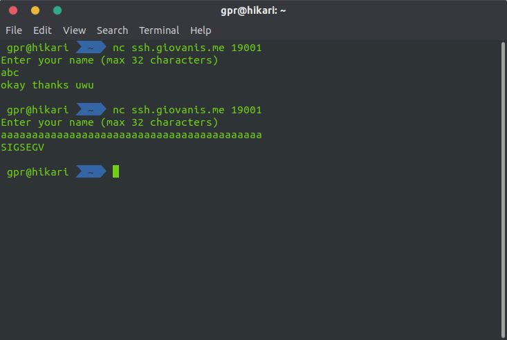
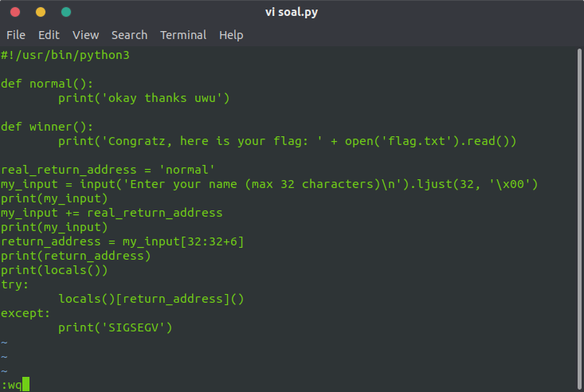
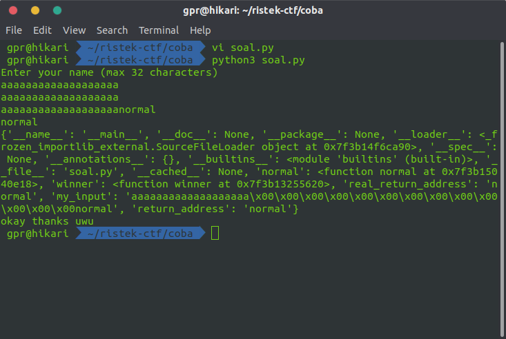
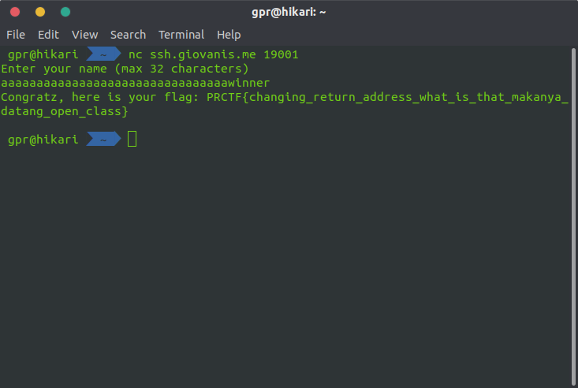

# tempat kembali

## Deskripsi

small data saving tool

`nc ssh.giovanis.me 19001`

author: Zafir

## File(s)

- [soal.py](files/soal.py)

## Hint

<details> 
    <summary>Hint 1</summary>
    <p>locals itu ngapain sih</p>
</details>

## Solusi

Diberikan file `soal.py` sebagai berikut.

```python
#!/usr/bin/python3

def normal():
	print('okay thanks uwu')

def winner():
	print('Congratz, here is your flag: ' + open('flag.txt').read())

real_return_address = 'normal'
my_input = input('Enter your name (max 32 characters)\n').ljust(32, '\x00')
my_input += real_return_address
return_address = my_input[32:32+6]
try:
	locals()[return_address]()
except:
	print('SIGSEGV')
```

Terlihat bahwa jika input panjangnya kurang dari 32, maka akan dipadding dengan
`\x00` dan ditambahkan `normal` di akhir. Pertama saya coba masukkan sembarang
string.



Sepertinya program memanggil fungsi `normal` jika panjangnya kurang dari 32 dan
print `SIGSEGV` jika panjangnya lebih dari 32. Saya mendapatkan ide bagaimana
caranya agar program memanggil fungsi `winner`.

Dari hint saya mencoba mencari tahu tentang fungsi `locals` di python.
Sepertinya fungsi tersebut mengembalikan semacam dictionary local variable yang
ada di suatu program.

Saya coba melihat hasil dari `locals` di program tersebut dengan mengedit dan
menjalankannya di lokal.





Hasilnya adalah dictionary seperti di atas. Selanjutnya saya harus mencari cara
untuk memanggil `locals()['winner']()` untuk mendapatkan flag. Saya harus bisa
mengubah nilai variable `return_address` menjadi string `winner`. Nilai dari
`return_address` didapatkan dari `my_input` mulai dari karakter 32 hingga 32+6.
Maka string input saya dari karakter ke 32 hingga 32+6 haruslah string `winner`,
saya masukkan saja string `aaaaaaaaaaaaaaaaaaaaaaaaaaaaaaaawinner`.



## Flag

`PRCTF{changing_return_address_what_is_that_makanya_datang_open_class}`
