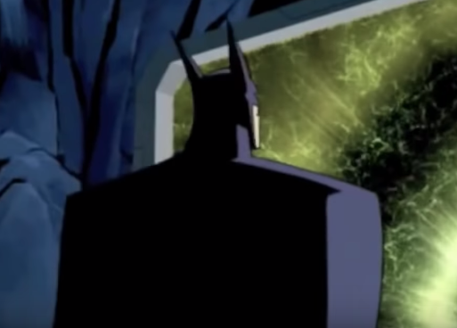
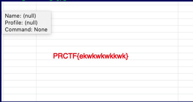

# Find The Fake Batman

## Deskripsi

Btw ingat ini bukan game "Spot the difference" ya...

author: FwP

## File(s)

- [batman.png](files/batman.png)
- [batmanplusplus.png](files/batmanplusplus.png)

## Hint

<details> 
    <summary>Hint 1</summary>
    <p>sizenya beda. Coba pisahin gambarnya</p>
</details>

## Solusi

Diberikan dua buah gambar batman yang terlihat sama.




Dari hint diketahui bahwa size-nya beda, kemungkinan gambar yang ukurannya lebih
besar ditambahkan sesuatu (kemungkinan gambar). Lalu dengan script python
berikut akan menghasilkan suatu gambar yang berisi flag.

```python
f = open('batman.png', 'rb').read()
g = open('batmanplusplus.png', 'rb').read()
h = g[len(f):]

flag = open('flag.png', 'wb')
flag.write(h)

flag.close()
```



## Flag

`PRCTF{ekwkwkwkkwk}`
