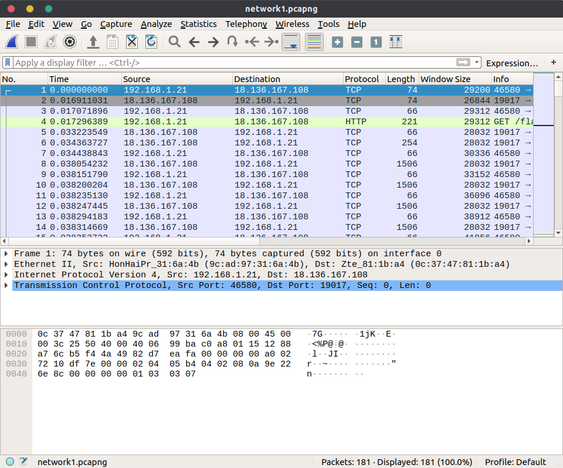
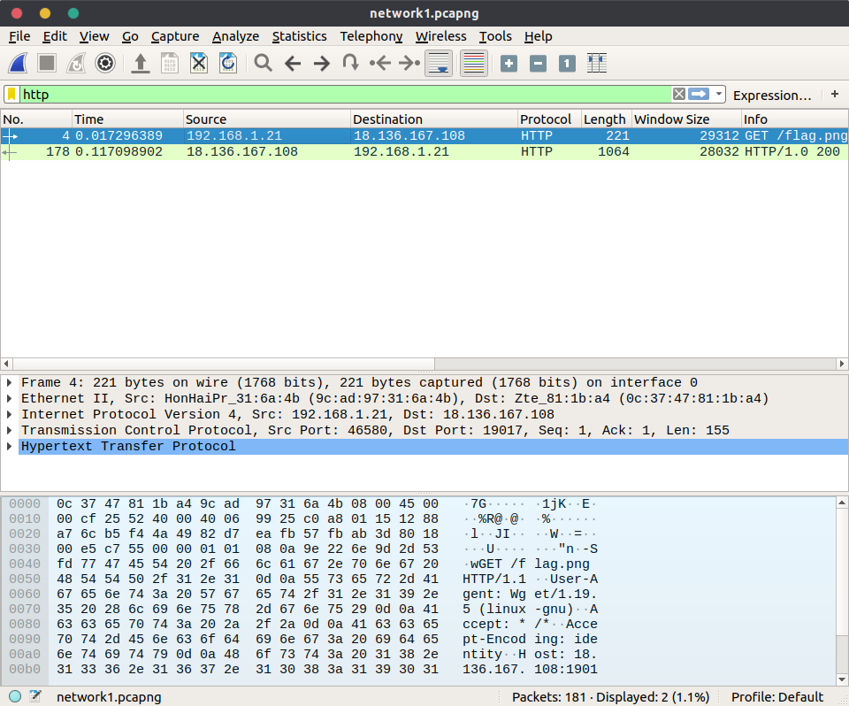

# Network 1

## Deskripsi

Can you get the flag from this network traffic?

[https://drive.google.com/file/d/1nSfbmLXkc0faYdSWYye3ozEACmfCkyb3/view?usp=sharing](https://drive.google.com/file/d/1nSfbmLXkc0faYdSWYye3ozEACmfCkyb3/view?usp=sharing)

author: giovanism

## File(s)

- [network1.pcapng](files/network1.pcapng)

## Hint

## Solusi

Diberikan sebuah file pcapng, hal yang pertama saya lakukan adalah membuka file
tersebut dengan wireshark.

Selanjutnya saya filter yang koneksinya http saja, langsung terlihat ada
`flag.png`.

Selanjutnya untuk mendapatkan file tersebut di wireshark klik `File` >
`Export Objects` > `HTTP` > pilih file `flag.png` > `Save`. Lalu didapatkanlah
gambar berikut.

## Flag

`PRCTF{3xp0rt_http_obj_e2}`
