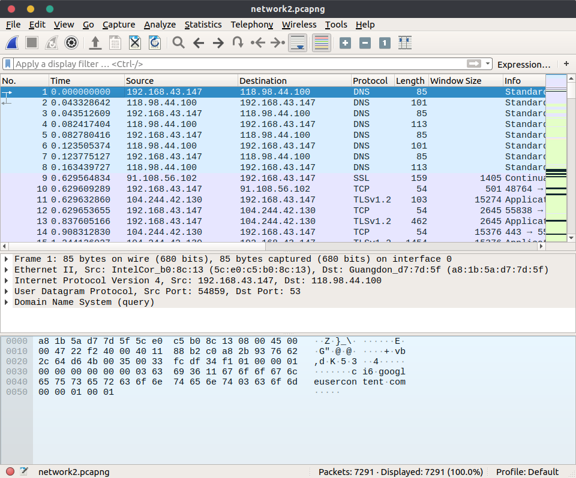
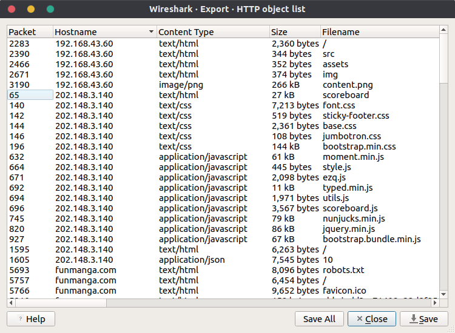
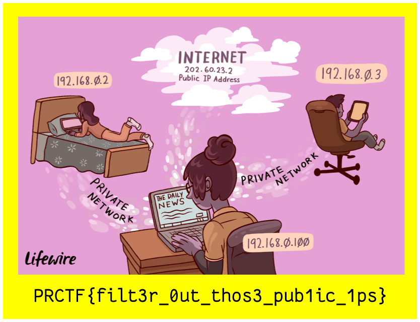

# Network 2

## Deskripsi

There are mysterious traffic between clients in the internal network. Can you
sniff out those traffic?

[https://drive.google.com/file/d/1D_hBQewjt0hrxJIL2thsk2iwKZ8lFDKc/view?usp=sharing](https://drive.google.com/file/d/1D_hBQewjt0hrxJIL2thsk2iwKZ8lFDKc/view?usp=sharing)

author: giovanism

## File(s)

- [network2.pcapng](files/network2.pcapng)

## Hint

 
    
Hint 1

    
Internal traffic uses private IP

## Solusi

Diberikan sebuah file pcapng, langsung saja dibuka dengan wireshark.

Pertama saya filter terlebih dahulu koneksi `http`. Selanjutnya saya menduga
bahwa soal ini mirip soal [network1](../network-1/README.md), saya langsung saja
coba export semua object nya.

Saya urutkan berdasarkan hostname-nya dan mencoba menebak file apa yang
kira-kira merupakan flag. Dari hint saya harus memperhatikan traffic dari
private IP dan file `content.png` terlihat mencurigakan karena file tersebut
merupakan satu-satunya gambar yang ada di traffic private IP. Setelah di-save
ternyata benar file tersebut merupakan flag.

## Flag

`PRCTF{filt3r_0ut_thos3_pub1ic_1ps}`
