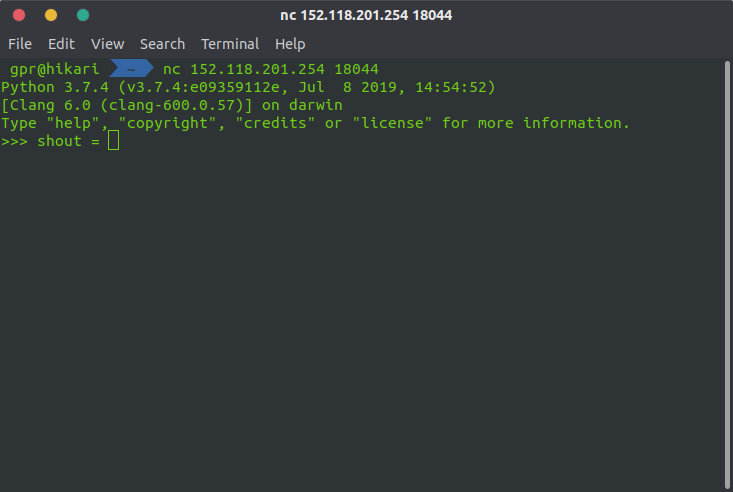
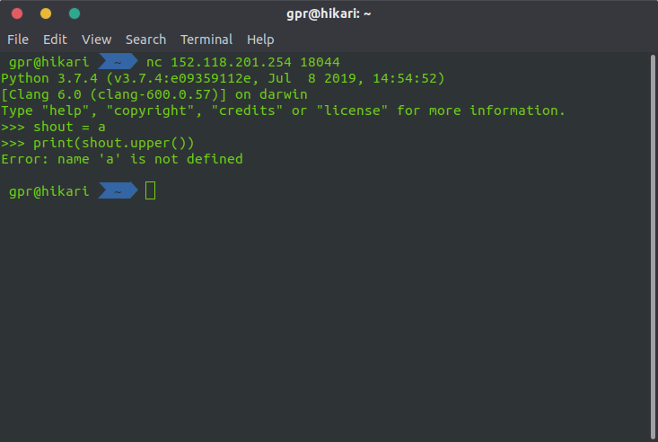
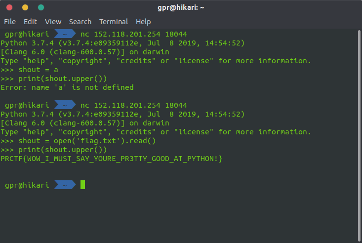
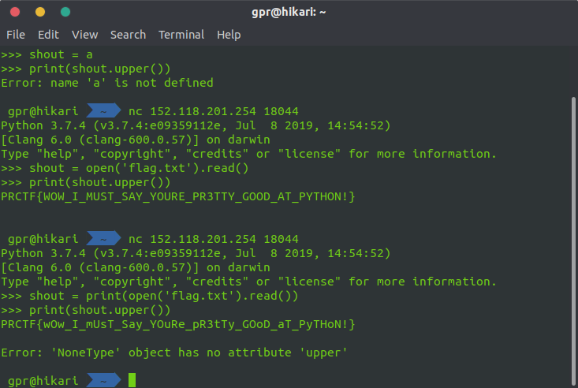

# Shout

## Deskripsi

`nc 152.118.201.254 18044`

author: distra

## File(s)

## Hint

 
    
Hint 1

    
the flag is stored in flag.txt, it is case sensitive

## Solusi

Diberikan sebuah perintah `nc 152.118.201.254 18044`, lalu setelah berhasil
masuk muncul tampilan seperti berikut.

Lalu saat dicoba memasukkan huruf 'a' hasilnya sebagai berikut.

Terlihat bahwa input tersebut langsung di eval. Dari hint diketahui bahwa flag
berada di flag.txt, kemudian saya mencoba untuk mengeksekusi open file sebagai
berikut.

Hal yang kemudian harus diperhatikan adalah dari hint diketahui bahwa flag-nya
case sensitive, sedangkan hasil yang didapatkan isinya huruf besar semua. Maka
saya menggunakan fungsi print agar hasil open file dari flag.txt langsung
keluar.

## Flag

`PRCTF{wOw_I_mUsT_Say_YOuRe_pR3tTy_GOoD_aT_PyTHoN!}`
