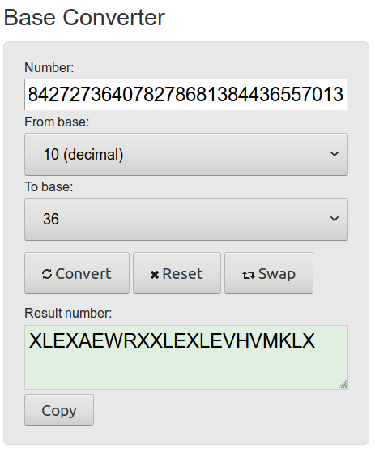
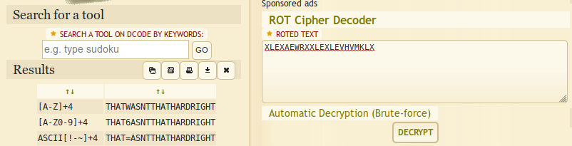
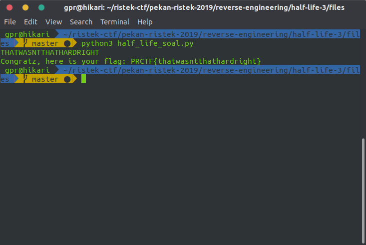

# half life 3

## Deskripsi

I think this is a demo for half life 3

author: Zafir

## File(s)

- [half_life_soal.py](files/half_life_soal.py)

## Hint

<details> 
    <summary>Hint 1</summary>
    <p>int(a, n) itu ngapain sih</p>
</details>

<details> 
    <summary>Hint 2</summary>
    <p>According to kak greg, this problem is very ROT(four)ten</p>
</details>

## Solusi

Diberikan sebuah file python yang sangat jelek sebagai berikut.

```python
(lambda x: print('Congratz, here is your flag: PRCTF{' + x + '}') if (lambda a: int((lambda b: ''.join([chr((ord(i)-97+1+(1^2))%26+97) for i in b]))(a), 36) if all([i in __import__('string').ascii_lowercase[-1:]+__import__('string').ascii_lowercase[:-1] for i in a]) else -1)(x) == 16166842727364078278681384436557013 else print('Nope'))(input().lower())
```

Pertama saya coba edit agar sedikit bisa lebih terbaca.

```python
(lambda x: print('Congratz, here is your flag: PRCTF{' + x + '}')
    if (lambda a: int((lambda b: ''.join([chr((ord(i)-97+1+(1^2))%26+97) for i in b]))(a), 36)
        if all([i in __import__('string').ascii_lowercase[-1:]+__import__('string').ascii_lowercase[:-1] for i in a])
        else -1)(x) == 16166842727364078278681384436557013
    else print('Nope'))(input().lower())
```

Jika diperhatikan, program tersebut akan menerima input dan menjadikan input
menjadi huruf kecil pada bagian `input().lower()` yang kemudian selanjutnya
(mungkin) mengecek apakah hasil `input().lower()` merupakan huruf kecil (yang
jawabannya tentu saja benar). Kemudian input yang sudah di lowercase sepertinya
di ROT cipher pada bagian
`(lambda b: ''.join([chr((ord(i)-97+1+(1^2))%26+97) for i in b]))`, kemudian
diubah ke basis 10 dari basis 36.

Karena malas untuk membuat script untuk reverse-nya, saya coba ubah
`16166842727364078278681384436557013` dari basis 10 ke basis 36 dengan
[base converter](https://www.rapidtables.com/convert/number/base-converter.html).



Kemudian string `XLEXAEWRXXLEXLEVHVMKLX` saya coba decrypt dengan
[ROT Cipher Online](https://www.dcode.fr/rot-cipher).



Saya coba masukkan string `THATWASNTTHATHARDRIGHT` ke program dan didapatkanlah
flagnya.



## Flag

`PRCTF{thatwasntthathardright}`
