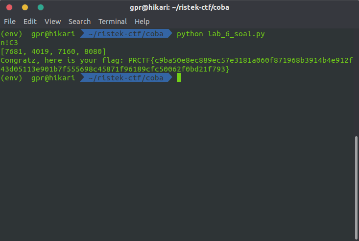

# Lab 6 DDP 1 kelas B dan C tanggal 1 Oktober 2019

## Deskripsi

:)

author: Zafirr

## File(s)

- [lab_6_soal.py](files/lab_6_soal.py)

## Hint

<details> 
    <summary>Hint 1</summary>
    <p>Ini soal bonus pas lab</p>
</details>

## Solusi

Diberikan file python sebagai berikut.

```python
import numpy as np
import hashlib

data = np.array([[50, 11, 18, 12], [18, 12, 23, 2], [21, 11, 35, 42], [47, 2, 12, 40]])
my_input = input()
password = np.array(list(map(ord, list(my_input[:4].ljust(4, '\x00')))))
result = list(np.matmul(data, password))
print(result)
if result == [7681, 4019, 7160, 8080]:
	print("Congratz, here is your flag: PRCTF{" + hashlib.sha384(bytes(my_input.encode())).hexdigest() + "}")
```

Perhatikan bahwa untuk mendapatkan flag, `result` harus bernilai
`[7681, 4019, 7160, 8080]`. Nilai `result` didapatkan dari
`list(np.matmul(data, password))`. `matmul` merupakan fungsi untuk mengalikan
matriks di numpy.

Perhatikan lagi bahwa perkalian matriks tersebut antara `data` dan `password`
kemudian menghasilkan `result`. Terlihat bahwa `password` berasal dari input
yang kemudian diubah menjadi list suatu angka dengan fungsi `ord`.

Misalkan `A` adalah `data`, password adalah `x`, dan `result` adalah `b`, kita
tahu bahwa.


<br>


<br>


Untuk mendapatkan `x` yang merupakan input yang akan menjadi `password`, caranya
adalah sebagai berikut.


Lalu kode yang saya buat untuk mendapatkannya adalah sebagai berikut.

```python
import numpy as np

data = np.array([[50, 11, 18, 12], [18, 12, 23, 2], [21, 11, 35, 42], [47, 2, 12, 40]])
result = np.array([7681, 4019, 7160, 8080])
password = ''.join([chr(int(round(i))) for i in list(np.linalg.solve(data, result))])
print(password)
```

Didapatkanlah string `n!C3` yang kemudian dimasukkan sebagai input.



## Flag

`PRCTF{c9ba50e8ec889ec57e3181a060f871968b3914b4e912f43d05113e901b7f555698c45871f96189cfc50062f0bd21f793}`
