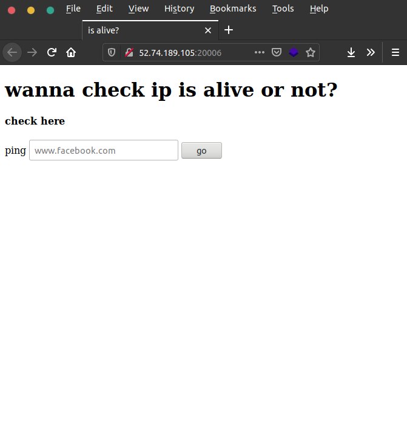
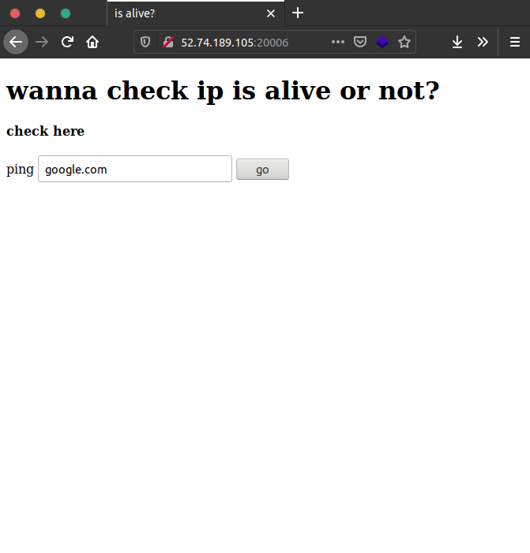
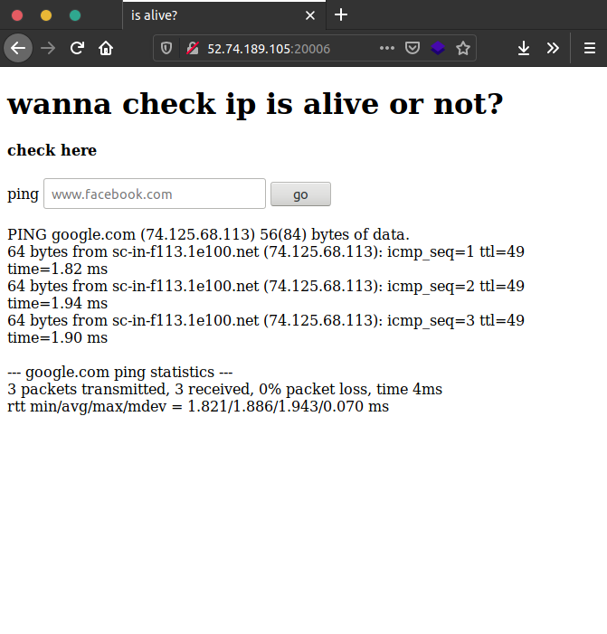
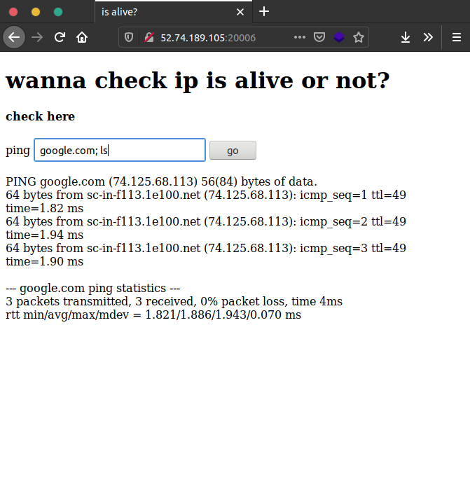
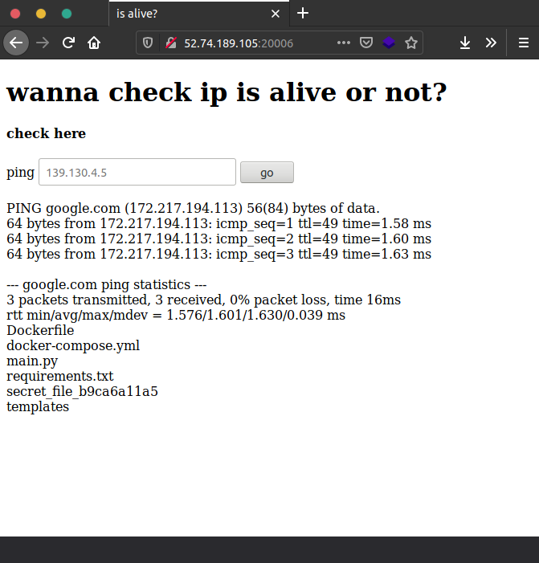
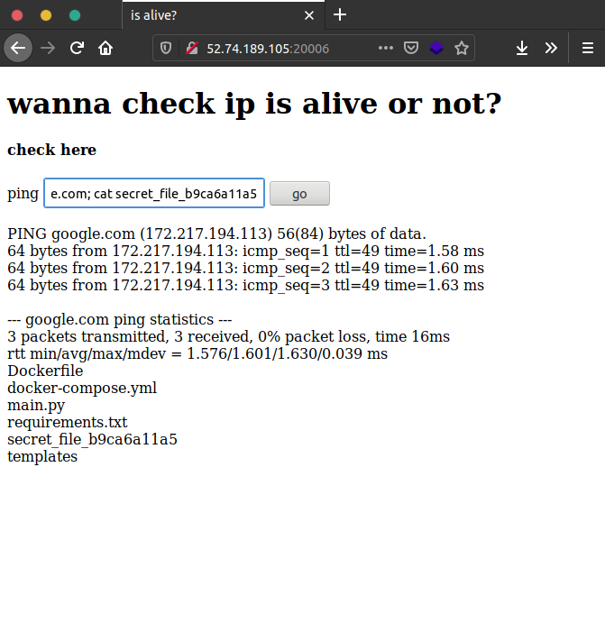
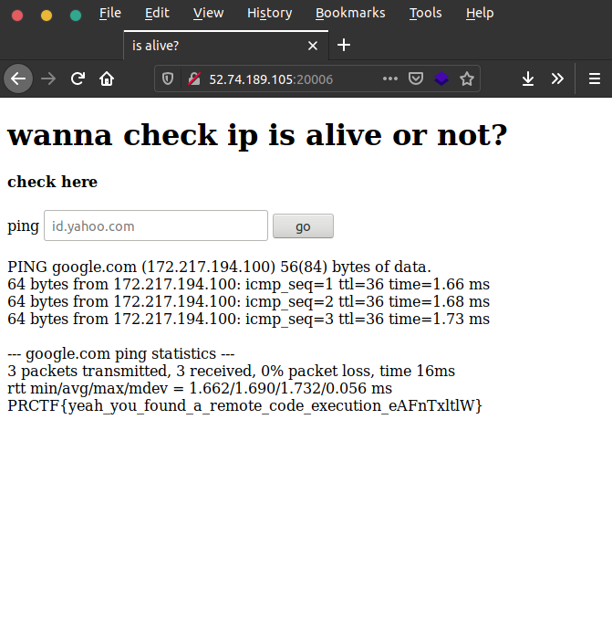

# Is it alive?

## Deskripsi

p p p p p p p p ping!

[http://52.74.189.105:20006/](http://52.74.189.105:20006/)

author: ariqbasyar

## File(s)

## Hint

 
    
Hint 1

    
rce

 
    
Hint 2

    
one-liner bash bash injection

## Solusi

Diberikan website dengan tampilan sebagai berikut.

Pertama saya coba masukkan `google.com` untuk mengetahui output. Hasil output
terlihat seperti hasil fungsi output di bash.

Kemudian saya menduga bahwa input akan dieksekusi di bash dengan format
`ping <input>`. Saya mencoba memasukkan `google.com; ls` dan berharap bisa
mengeluarkan list file yang ada.

Terlihat ada list file yang ada dalam file tersebut. Lalu saya masukkan
`google.com; cat secret_file_b9ca6a11a5`.

## Flag

`PRCTF{yeah_you_found_a_remote_code_execution_eAFnTxltlW}`
