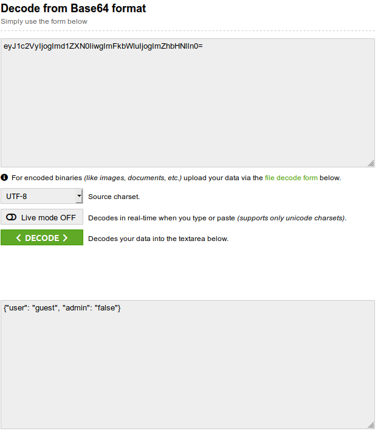

# Only Admin 2

## Deskripsi

let's see that you can get the admin privileges (2)

[http://52.74.189.105:20002/](http://52.74.189.105:20002/)

author: ariqbasyar

## File(s)

## Hint

 
    
Hint 1

    
base64

 
    
Hint 2

    
Eyeyeyey

## Solusi

Diberikan website dengan tampilan berikut.

Hal yang pertama dilakukan adalah mengecek cookies dengan dev tools.

Terlihat ada dua cookies dan salah satunya admin. Pertama saya coba mengganti
nilai cookies admin menjadi true lalu refresh.

Hasilnya malah di-redirect ke link youtube
[https://www.youtube.com/watch?v=UAlIq7BKNxg](https://www.youtube.com/watch?v=UAlIq7BKNxg)

Lalu saya melihat cookies yang satunya lagi. Terlihat bahwa cookie tersebut
berawalan `ey` yang kemungkinan besar merupakan json yang di encode ke base64.

Saya lalu menggunakan [base64 decoder](https://www.base64decode.org/).

Kemudian dengan [base64 encoder](https://www.base64encode.org/) saya ubah json
yang sudah diubah nilai adminnya menjadi true ke base64.

Kemudian saya ubah cookies is_admin dengan base64 yang baru tersebut.

## Flag

`PRCTF{congratz_haha_ez_admin_2_73cefa5bb5800}`
