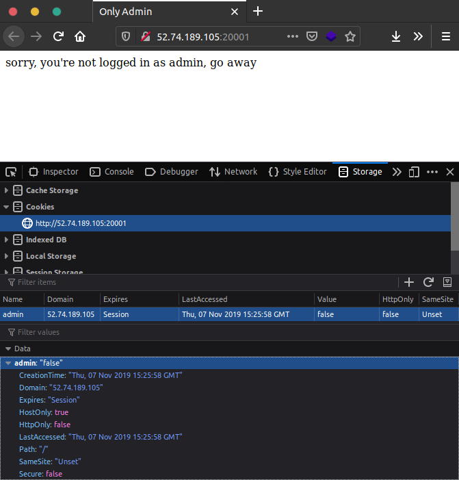

# Only Admin

## Deskripsi

let's see that you can get the admin privileges

[http://52.74.189.105:20001/](http://52.74.189.105:20001/)

author: ariqbasyar

## File(s)

## Hint

 
    
Hint 1

    
cookie

## Solusi

Diberikan website dengan tampilan berikut.

Selanjutnya cek cookie website tersebut dengan dev tools.

Terlihat bahwa terdapat value admin yang bernilai false dalam cookie.
Selanjutnya edit nilainya menjadi true dan refresh.

## Flag

`PRCTF{congratz_haha_ez_admin_1ce9307db61}`
